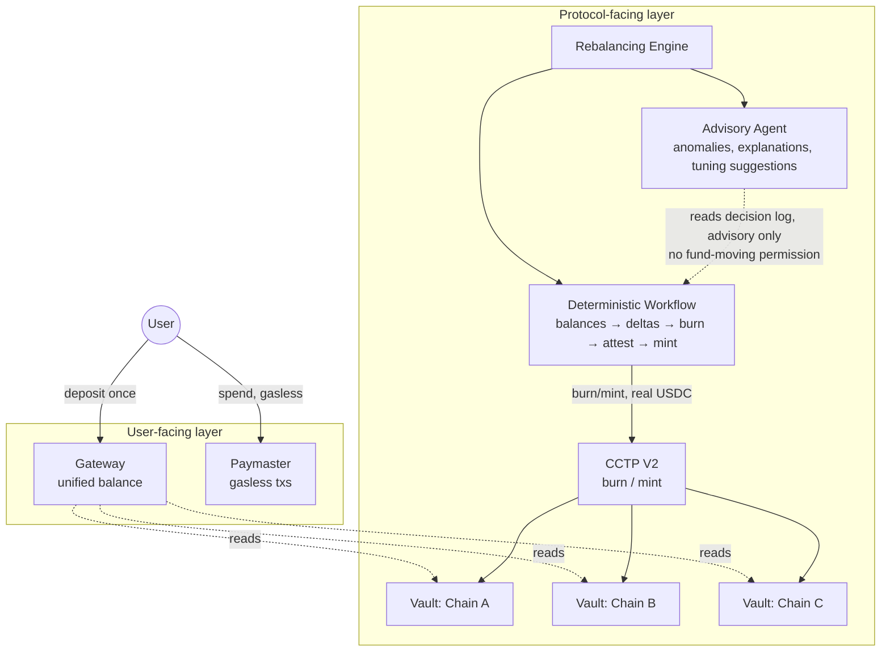

# HedgeFlow

**AI-assisted, cross-chain liquidity protection for USDC.**

HedgeFlow keeps USDC usable everywhere at once. It watches per-chain reserves, moves USDC between chains via Circle's CCTP V2 before any chain runs dry, gives users one deposit that behaves as a single unified balance (Circle Gateway), and removes gas-token friction entirely (Circle Paymaster). Fund movement is 100% deterministic; an AI layer sits alongside it in an advisory-only role — anomaly detection, plain-language explanations, threshold-tuning suggestions — and never holds a key capable of moving money.

This repo is currently a **scaffold**: folder structure, config, and typed stubs with `TODO`s pointing at the relevant PRD requirement, not a working implementation. See [`docs/PRD.md`](docs/PRD.md) for the full product spec — this README is the map of how that spec turns into code.

> **Status:** pre-implementation scaffold. Nothing here has been audited or deployed. Do not point this at real funds.

---

## Table of contents

- [Why this exists](#why-this-exists)
- [Architecture](#architecture)
- [Repo layout](#repo-layout)
- [Prerequisites](#prerequisites)
- [Getting started](#getting-started)
  - [Contracts](#contracts)
  - [Engine](#engine)
  - [Frontend](#frontend)
- [Environment variables](#environment-variables)
- [The fund-movement rule](#the-fund-movement-rule)
- [Roadmap](#roadmap)
- [Open questions](#open-questions)
- [Security](#security)

---

## Why this exists

USDC liquidity is fragmented across chains: one chain drains while another sits idle, causing failed transactions and stuck withdrawals. The usual workarounds — manual bridging, wrapped-asset bridges, holding gas tokens on five different chains — push all of that complexity onto the user. HedgeFlow absorbs the complexity into the protocol instead: users see one balance that always works; the protocol does the rebalancing behind the scenes.

## Architecture

Two layers, matching the PRD's system design (§5):



**User-facing layer**
- **Gateway** — one deposit, unified balance, usable on any supported chain in under ~500ms.
- **Paymaster** — fees sponsored or paid in USDC; no native gas token ever required.

**Protocol-facing layer**
- **Rebalancing engine** — the system that decides when and how much USDC to move.
  - **Workflow (deterministic)** — check balances → compute deltas against target thresholds → burn on the surplus chain → poll CCTP attestation → mint on the deficit chain. No LLM anywhere in this path.
  - **Agent (AI, advisory)** — anomaly detection, plain-language rebalance explanations, threshold-tuning suggestions. Requires human approval to change anything; cannot hold a fund-moving key.
- **CCTP V2** — burns real USDC on the source chain, mints real USDC on the destination. No wrapped assets.
- **Vaults** — one smart contract per supported chain, holding that chain's share of protocol reserves.

## Repo layout

```
HedgeFlow/
├── contracts/            Foundry project — one Vault per chain (PRD §6.1)
│   ├── src/Vault.sol         placeholder contract, see TODOs inside
│   ├── script/Deploy.s.sol   placeholder deploy script
│   ├── test/Vault.t.sol      placeholder test
│   └── foundry.toml
├── engine/                TypeScript rebalancing engine, built on Mastra (PRD §6.2, §6.3, §9)
│   └── src/
│       ├── config/chains.ts          MVP chain set (Ethereum/Arbitrum/Base Sepolia)
│       ├── mastra/
│       │   ├── workflows/            deterministic execution graph — FR-5..FR-9
│       │   ├── agents/               advisory-only AI layer — FR-11..FR-14
│       │   └── tools/                chain RPC, CCTP V2, Gateway wrappers
│       ├── lib/logger.ts
│       ├── types.ts
│       └── index.ts                   entrypoint / poll loop
├── frontend/               User-facing deposit + unified-balance UX (PRD §6.4) — milestone 4, placeholder
├── docs/
│   └── PRD.md              full product requirements doc
├── package.json            npm workspaces root (engine, frontend)
└── README.md               you are here
```

## Prerequisites

- [Node.js](https://nodejs.org/) 20+ and npm (workspaces are npm-based)
- [Foundry](https://getfoundry.sh/) (`forge`, `cast`, `anvil`) for the contracts package
- Testnet RPC access for the MVP chain set (Ethereum Sepolia, Arbitrum Sepolia, Base Sepolia) — Alchemy/Infura/etc.
- A Circle developer account for CCTP V2 and Gateway API access
- An Anthropic API key for the advisory agent layer

## Getting started

### Contracts

```bash
cd contracts
forge install foundry-rs/forge-std   # only external dep the scaffold references
forge build
forge test
```

`src/Vault.sol` is currently an empty contract with a `TODO` list matching FR-1 through FR-4 and FR-10. `script/Deploy.s.sol` and `test/Vault.t.sol` are placeholders to fill in alongside it.

### Engine

```bash
cd engine
cp .env.example .env   # fill in RPC URLs, controller key, Circle + Anthropic API keys
npm install
npm run dev
```

The engine currently just boots and logs a placeholder message. The real work is wiring up `src/mastra/tools/*` (chain RPC reads, CCTP burn/mint, Gateway queries), then `src/mastra/workflows/rebalance.workflow.ts` (the deterministic loop), then `src/mastra/agents/anomaly-agent.ts` (advisory layer) — in that order, per the [roadmap](#roadmap).

### Frontend

Placeholder only — `frontend/package.json` exists so the npm workspace resolves, but the app itself (wallet connect + Gateway/Paymaster SDK integration) is milestone 4 work and hasn't been scaffolded yet.

## Environment variables

Engine (`engine/.env`, see `engine/.env.example`):

| Variable | Purpose |
|---|---|
| `ETH_SEPOLIA_RPC_URL`, `ARB_SEPOLIA_RPC_URL`, `BASE_SEPOLIA_RPC_URL` | Per-chain RPC endpoints for the MVP chain set |
| `CONTROLLER_PRIVATE_KEY` | Key authorized to move vault funds. **Never** give this to the AI agent (FR-14) |
| `CIRCLE_API_KEY` | CCTP V2 / Gateway API access |
| `ANTHROPIC_API_KEY` | Model access for the advisory agent |
| `POLL_INTERVAL_MS` | How often the engine checks balances (FR-5) |
| `MIN_RESERVE_RATIO` | Threshold that triggers a rebalance (FR-6, FR-7) |

Contracts (`contracts/foundry.toml` reads these from your shell env when scripting/verifying):

| Variable | Purpose |
|---|---|
| `ETH_SEPOLIA_RPC_URL`, `ARB_SEPOLIA_RPC_URL`, `BASE_SEPOLIA_RPC_URL` | Same RPC endpoints, used by `forge script` |
| `ETHERSCAN_API_KEY`, `ARBISCAN_API_KEY`, `BASESCAN_API_KEY` | Contract verification |

## The fund-movement rule

The single rule that governs this codebase, straight from the PRD:

> If it's the **user's own action** (deposit, spend, withdraw) → **Gateway + Paymaster**.
> If it's the **protocol moving its own reserves** → **CCTP V2 via the rebalancing engine's deterministic workflow**.

The AI agent never initiates either kind of transfer. It reads, explains, and suggests — it does not hold keys.

## Roadmap

Matches PRD §10:

1. **Testnet proof of concept** — one rebalance loop working end-to-end, 2 chains, manually triggered, no AI layer.
2. **Automated rebalancing** — deterministic workflow on a schedule/threshold trigger, 3 chains.
3. **AI agent layer** — anomaly detection + decision explanations, backtested against historical data.
4. **User-facing layer** — Gateway + Paymaster wired into a real frontend.
5. **Audit + mainnet** — third-party smart contract audit, then launch with capped real reserves.

This scaffold is pre-milestone-1: structure and interfaces exist, none of the logic does yet.

## Open questions

Carried over from PRD §8 — decide these before implementing the corresponding piece:

- **Vault custody model** — owned EOA, Safe multisig, or on-chain governance controls `Vault.controller`?
- **Rebalance trigger logic** — simple threshold, or incorporate predictive signals (utilization trend, withdrawal queue)?
- **Chain set for MVP** — scaffold assumes Ethereum/Arbitrum/Base Sepolia; confirm before deploying.
- **Threshold-tuning approval flow** — who reviews AI-suggested threshold changes, and how often?
- **Fee model** — who absorbs Gateway's onchain fee and Paymaster's markup, protocol or user?

## Security

- Nothing in this repo has been audited. Testnet only until PRD §7's audit requirement is satisfied.
- The advisory agent must never be granted a tool, key, or permission capable of moving funds (FR-14) — enforce this at the Mastra agent config level, not just by convention.
- Vault fund movement is controller-gated by design (FR-3); treat `CONTROLLER_PRIVATE_KEY` with the same care as a hot wallet key, because it is one.
# HedgeFlow
